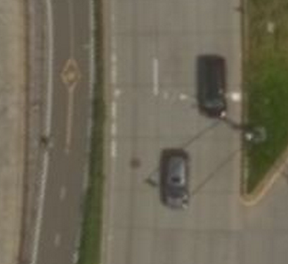
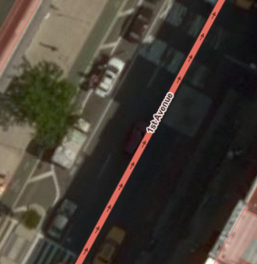

# Adding bike lanes in the city's database but not in OSM

OSM currently has some major gaps in coverage in comparison with the city data.
As a result, this challenge is mostly adding new data. Exciting!

## Do I even need to do anything?

For each task in this challenge there are three potential situations:

 1. **The bike lane is already well-mapped in OSM**. You look at the line of the
    city's bike lane and there is already a bike lane in OSM that matches pretty
    well.
    
    You're done here. Either the data was already in OSM or someone beat you to
    the task.
 2. **The bike lane is already in OSM, but it doesn't line up very well** with 
    the city's data. Look around in a 50-foot radius of the bike lane you're 
    supposed to draw, do you see a line in OSM that follows the same street? 
    Judging from the aerial imagery, is the OSM bike lane in the wrong place?
    
    If so, nudge the bike lane into the proper location using the aerial imagery
    and the city's data. Then check the tags in OSM (see below).
 3. **The bike lane doesn't exist in OSM at all**. In step 2 you checked around
    the city bike lane and didn't find anything.
    
    When this happens, draw a line that follows the portion of the bike lane
    that is being shown to you. Use the tagging guide below to help decide how 
    to tag your line.

## Tagging guide

We recommend reading the OSM Wiki page on
[bicycles](http://wiki.openstreetmap.org/wiki/Bicycle), which contains a
detailed list of potential bike lane scenarios and how you should tag them. The
page helpfully depicts bike lane situations and lists the tags you should use
for each. 

### Types of bike lanes

In NYC we'll commonly see four types of bike lanes:

 1. Completely separate bike lanes. Think the Hudson River Greenway on the west
    side of Manhattan.
    
    
 2. Bike lanes that are part of a road but are separated from traffic (eg by a
    row of parking). Think the lanes that run along 1st and 2nd Ave in
    Manhattan. The city refers to these as Class I bike lanes.
    
    
 3. Bike lanes that are part of a road but are only separated from traffic by a
    line of paint. The city refers to these as Class II bike lanes.
    
    
    
 4. Parts of roads that have a bicycle painted on them with arrows. These aren't
    separated from traffic at all and are simply gentle reminders that drivers
    are supposed to share the road with bicyclists. These are appropriately
    called shared lanes or "sharrows". The city refers to these as Class III
    bike lanes.
    
    

### Mapping each bike lane type

 1. Separate bike lanes. Use [highway=cycleway](http://wiki.openstreetmap.org/wiki/Tag:highway%3Dcycleway).
 2. Class I bike lanes. Use cycleway=track if the lane is on both sides,
    cycleway:left=track or cycleway:right=track otherwise.
 3. Class II bike lanes. Use cycleway=lane if on both sides, else be sure to add
    :left or :right (see above).
 4. Class III bike lanes. Use
    [cycleway=shared_lane](http://wiki.openstreetmap.org/wiki/Proposed_features/shared_lane)
    and be sure to indicate which side of the street the lane is on as
    necessary.

### General guidelines

 * Only use [highway=cycleway](http://wiki.openstreetmap.org/wiki/Tag:highway%3Dcycleway)
   if the bike lane is not on a road.
 * Watch out for roads that have
   [cycleway=lane](http://wiki.openstreetmap.org/wiki/Bicycle#Cycle_lanes_in_oneway_motor_car_roads)
   tagged on them. It's easy to think you need to add a new line for a bike 
   lane when it is already incorporated into a road.
 * Even when a bike lane is separated from a road, if it runs along the road it
   is preferred that you use
   [segregated=yes](http://wiki.openstreetmap.org/wiki/Bicycle#Miscellaneous)
   (examples S3 and S4) rather than draw a separate line.
 * Use [cycleway](http://wiki.openstreetmap.org/wiki/Key:cycleway):left=* and
   cycleway:right=* for roads where bike lanes are only on one side or the
   other. Here "left" and "right" refer to the left and right sides of the 
   line in *OSM*. This is easy to see with one-way streets, but even two-way
   streets should have arrows pointing in the direction of the line.
 * Be careful when editing very long lines. Sometimes a street will have one
   type of bike lane for a few blocks, then another type for a few blocks.
   Follow the street while you have it selected to ensure that you are only
   adding bike lanes where they actually exist. You may have to split the line.
